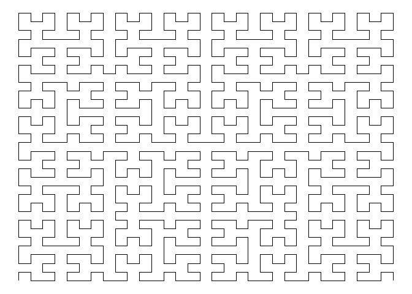

<!-- README.md is generated from README.Rmd. Please edit that file -->

# fractals

<!-- badges: start -->

[](https://lifecycle.r-lib.org/articles/stages.html#experimental)
<!-- badges: end -->

Fractals is a shiny app for visualization of fractals.

## Installation

You can install the development version of fractals like so:

``` r
install.packages(devtools)
devtools::install_github("https://github.com/AnjaH8/fractals.git")
```

## Run the app

You can run the shiny app like this:

``` r
library(fractals)
run_app()
```

In the app there is a dropdown menu where you can choose which fractal
you want to display (currently only the Hilbert curve) and a slider to
determine the number of iterations.

## Example

This is a basic example which shows you how you can display the
Hilbert-curve after 5 iterations:

``` r
library(fractals)
df_hilbert <- hilbert_curve(5)
ffplot(df_hilbert)
```


